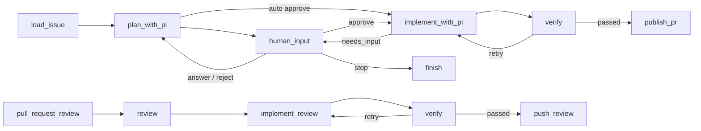

# Coding Agent Graph

סוכן קוד מקומי שמקבל פקודות מתגובות ב־GitHub Issues. FastAPI קולט webhooks, ‏LangGraph מנהל את התהליך והעצירות, Pi חוקר ועורך קוד ב־worktree ייעודי, ו־SQLite שומר checkpoints ומטא־דאטה.

## תהליך העבודה



Pi מתכנן עם כלי קריאה וחיפוש בלבד. לאחר אישור מפורש הוא מקבל כלי עריכה ו־shell בתוך ה־worktree. השירות עצמו בודק את ה־diff ומריץ `npm run lint` ו־`npm run build`; Pi אינו מקבל משתני GitHub ואינו מבצע push בעצמו. לאחר verification מוצלח השירות מבצע commit ו־push ופותח PR אוטומטית.

כאשר נשלח review מסוג **Request changes** או **Comment**, השירות טוען את סיכום ה־review ואת ה־inline comments, מחזיר אותם ל־Pi באותו worktree/session, מאמת את התיקונים ודוחף commit נוסף לאותו PR. Review מסוג **Approve** אינו משנה קוד והמיזוג נשאר ידני.

### אישור תוכנית

כברירת מחדל התוכנית ממתינה ל־`/agent approve`. ‏`/agent start auto` מדלג על האישור עבור ריצה אחת, ו־`REQUIRE_PLAN_APPROVAL=false` מדלג עליו כברירת מחדל. במצב זה התוכנית מתפרסמת כתגובה אינפורמטיבית והמימוש מתחיל מיד; שאלות הבהרה (`needs_input`) עדיין עוצרות לתשובה אנושית, וה־PR נשאר נקודת הבקרה.

### תוצאה מובנית מ־Pi

Pi מסיים כל שלב בקריאה לכלי `submit_result` (‏[pi_extensions/submit_result.ts](pi_extensions/submit_result.ts)), שנטען עם `--extension`. הסכמה נאכפת על ידי Pi, הסטטוסים המותרים מוגבלים לפי השלב (`ready|needs_input|failed` בתכנון, `completed|needs_input|failed` במימוש), והכלי מחזיר `terminate: true` כך שאין סבב LLM נוסף. השירות קורא את התוצאה מאירוע `tool_execution_end` במקום לחלץ JSON מטקסט חופשי; חילוץ מטקסט נשאר רק כ־fallback למודלים שלא קוראים לכלי.

## התקנה והרצה

נדרש Python 3.11 ומעלה, Node.js, ‏Git ו־Pi.

```bash
npm install -g @earendil-works/pi-coding-agent

cd coding-agent-graph
python -m venv .venv
# Windows: .venv\Scripts\activate
# macOS/Linux: source .venv/bin/activate
pip install -r requirements.txt

cp .env.example .env
python -m uvicorn main:app --host 0.0.0.0 --port 8000
```

אין להפעיל את שרת הסוכן עם `--reload`: יצירת SQLite checkpoints ו־worktrees משנה קבצים מקומיים, ו־WatchFiles עלול להפעיל restart ולבטל את ה־worker באמצע ריצה. לאחר שינוי קוד, עצור והפעל את השרת מחדש ידנית.

ב־Windows עם מספר גרסאות Python אפשר ליצור את הסביבה באמצעות `py -3.13 -m venv .venv`.

יש להגדיר ב־`.env`:

- `GITHUB_TOKEN` — קריאת Issues, כתיבת תגובות, ובהמשך push ופתיחת PR. אם הוא ריק, השירות קורא את הטוקן המקומי מ־`gh auth token`. אין בקשת ולידציה יזומה לטוקן.
- `AUTHORIZED_GITHUB_USERS` — רשימת משתמשים מורשים מופרדת בפסיקים.
- `OPENROUTER_API_KEY` — מפתח שנמסר רק לתהליך Pi.
- `OPENROUTER_MODEL` — ברירת מחדל: `z-ai/glm-5.3`.

### מעקב אחרי הגרף עם Langfuse

כדי לראות כל הרצה כ־trace ואת סדר ה־nodes, הקלט/פלט, זמני הריצה והשגיאות, צור project ב־Langfuse והוסף ל־`.env`:

```dotenv
LANGFUSE_PUBLIC_KEY=pk-lf-...
LANGFUSE_SECRET_KEY=sk-lf-...
LANGFUSE_BASE_URL=https://cloud.langfuse.com
LANGFUSE_TRACING_ENVIRONMENT=development
LANGFUSE_TRACING_ENABLED=true
```

לאחר הפעלה מחדש של השרת, הרץ `/agent start` ופתח את **Tracing → Traces** ב־Langfuse. כל הפעלה או חידוש של הגרף מופיעים בשם `coding-agent:<action>`; כל מקטעי אותה ריצה מקובצים תחת session שזהה ל־`run_id`. אפשר לסנן גם לפי `repository`, ‏`issue_number`, ‏`action` והתגית `coding-agent-graph`.

אם שני המפתחות אינם מוגדרים, Langfuse כבוי והשירות ממשיך לעבוד ללא שינוי. אפשר להשבית במפורש באמצעות `LANGFUSE_TRACING_ENABLED=false`. שים לב ש־Langfuse מקבל את מצב הגרף, לרבות תוכן ה־Issue, התוכנית והחלטות האדם; בחר סביבת אירוח ומדיניות retention שמתאימות לרגישות המידע שלך.

כל webhook נבדק מול `GITHUB_WEBHOOK_SECRET`: השרת מחשב HMAC-SHA256 של גוף הבקשה ומשווה לכותרת `X-Hub-Signature-256`. חתימה חסרה או שגויה מחזירה `401`. אם הסוד לא מוגדר, השרת מסרב לכל webhook (`500`), כדי שאי אפשר יהיה לזייף payload עם שם של משתמש מורשה. ליצירת סוד: `python -c "import secrets; print(secrets.token_hex(32))"`.

שאר ברירות המחדל מתועדות ב־`.env.example`. מצב LangGraph, בקשות, אירועי כלים, worktrees וסשני Pi נשמרים תחת `.agent-data` ואינם נשמרים ב־Git.

גם תור ה־webhooks נשמר ב־SQLite. השרת מחזיר `accepted` רק לאחר שמירת פריט העבודה, ומחזיר אוטומטית פריטים במצב `queued` או `processing` לתור לאחר restart. כשל בלתי צפוי מנוסה עד שלוש פעמים לפני שהפריט מסומן `failed`; כך restart באמצע review אינו דורש יצירת הערה חדשה.

## הרצה בענן (Docker Cloud Sandboxes)

עם `EXECUTION_MODE=cloud` ב־`.env`, ‏Pi והפקודות על הקוד רצים ב־[Docker Cloud Sandbox](https://docs.docker.com/ai/sandboxes/cloud/) ולא על המחשב המקומי. כל run מקבל sandbox משלו בשם `agent-issue-<N>-<run>`, שנוצר מה־Kit הרשמי של Pi ([`docker.io/docker/sbx-kit-pi`](https://github.com/docker/sbx-kits-contrib/tree/v3/pi), Kit v3).

בתוך ה־sandbox הסקריפט [sandbox/agent.sh](sandbox/agent.sh) משכפל את ה־repository, יוצר את ה־branch ומריץ את Pi. אחר כך הוא מריץ `npm ci`, ‏`npm run lint` ו־`npm run build`, ולבסוף עושה commit ו־push. השירות מחליט מתי לדחוף: רק אחרי שהבדיקות עברו. אחר כך הוא פותח את ה־PR כמו במצב המקומי. אירועי Pi זורמים חזרה דרך `sbx exec`, כך ש־`pi_logs.py`, ‏Langfuse והתגובות ב־Issue עובדים בלי שינוי.

**המפתחות לא נכנסים ל־sandbox.** הם שמורים ב־secret store של Docker, ו־proxy של ה־sandbox מוסיף אותם לבקשות היוצאות. בתוך ה־sandbox יש רק ערכי placeholder. הרשת חסומה כברירת מחדל (`deny-all`). מותר רק מה שה־Kit מצהיר עליו, וגם `SANDBOX_ALLOW_NETWORK`.

### הגדרה חד־פעמית

```bash
# Windows: winget install -h Docker.sbx
sbx login
sbx --cloud diagnose                        # כל השורות צריכות להיות ✓

sbx --cloud secret set github               # טוקן עם Contents: Read and write ל־repository
sbx --cloud secret set-custom --name openrouter --host openrouter.ai --env OPENROUTER_API_KEY
```

OpenRouter אינו שירות מובנה בענן, ולכן הוא נשמר כ־custom secret: ה־proxy מוסיף `Authorization: Bearer <key>` לבקשות ל־`openrouter.ai`. הטוקן של GitHub משמש את ה־sandbox גם לדחיפה, לכן מומלץ fine‑grained PAT ל־repository הזה בלבד, יחד עם branch protection על `main`.

### מחזור החיים של sandbox

- ה־sandbox נוצר עם `--ttl 24h --on-timeout stop`. כשהזמן נגמר הוא נעצר ולא נמחק, ו־sandbox עצור אינו עולה כסף.
- `sbx exec` מפעיל מחדש sandbox עצור, וזה לוקח כ־2 שניות. הקבצים וה־session של Pi נשמרים, כך שהמתנה לאישור או ל־review ממשיכה מאותה נקודה.
- `/agent stop` עוצר גם את Pi שרץ בתוך ה־sandbox.
- בזמן שהשירות מחכה לתשובה או ל־review, ה־sandbox נעצר ולא עולה כסף.
- כשה־PR ממוזג או נסגר, השירות מוחק את ה־sandbox (במצב מקומי: את ה־worktree) ומסמן את ה־run כ־`merged` או `closed`. לשם כך ה־webhook צריך לכלול גם אירועי **Pull requests**. ניקוי ידני: `sbx --cloud ls` ואז `sbx --cloud rm <name>`.

### מעקב ידני

```bash
sbx --cloud ls                                   # sandboxes פעילים ועצורים
sbx --cloud exec -it agent-issue-12-ab12cd34 bash # להיכנס, לראות קבצים ו־git diff
sbx --cloud policy log agent-issue-12-ab12cd34   # בקשות רשת שנחסמו
```

## חיבור GitHub

חשוף את השרת באמצעות tunnel, לדוגמה:

```bash
ngrok http 8000
```

ב־repository פתח **Settings → Webhooks → Add webhook** והגדר:

- Payload URL: `https://<tunnel-host>/webhooks/github`
- Content type: `application/json`
- Secret: אותו ערך כמו `GITHUB_WEBHOOK_SECRET` ב־`.env` (חובה)
- Events: **Issue comments**, ‏**Pull request reviews** ו־**Pull requests** (לניקוי אחרי מיזוג)

## אירועי מפתח ו־Telegram

[events.py](events.py) מרכז את אירועי המפתח של כל run: התחלה; ‏sandbox שנוצר, הופעל, נעצר או נמחק; ניסיונות חוזרים מול Docker; תוכנית; שאלה שממתינה לתשובה; בדיקות שעברו או נכשלו; ‏PR שנפתח; תיקוני review; סיום; וסגירת PR. כל אירוע נשמר בטבלת `events` ב־SQLite ומופיע בלוג של השרת:

```bash
python events.py                      # האירועים האחרונים
python events.py --follow             # מעקב רציף
python events.py --run-id d83d7e04    # ציר הזמן של run אחד
```

אם מוגדרים גם `TELEGRAM_BOT_TOKEN` וגם `TELEGRAM_CHAT_ID`, האירועים נשלחים גם לקבוצת Telegram, עם Topic לכל Issue. אם אחד מהם חסר, Telegram כבוי. השליחה רצה בתור ברקע: תקלה ב־Telegram או עומס לא עוצרים ולא מאטים את ה־run, והאירוע נשאר ב־SQLite בכל מקרה. אם בקבוצה אין Topics, או שאין לבוט הרשאה לנהל אותם, ההודעות נשלחות לצ'אט הראשי. תוכן Issues ותוכניות מגיע ל־Telegram, וטוקנים ומפתחות מצונזרים.

**הגדרת הקבוצה:**
1. ב־[@BotFather](https://t.me/BotFather): ‏`/newbot`. הטוקן שמתקבל הולך ל־`TELEGRAM_BOT_TOKEN`.
2. ליצור קבוצה, ובהגדרות שלה ‏(Edit) להפעיל **Topics**.
3. להוסיף את הבוט לקבוצה ולמנות אותו ל־**Admin** עם ההרשאה **Manage Topics**.
4. לשלוח הודעה כלשהי בקבוצה ולפתוח `https://api.telegram.org/bot<TOKEN>/getUpdates`. הערך של `chat.id` (מספר שמתחיל ב־`-100`) הולך ל־`TELEGRAM_CHAT_ID`.

## מעקב אחרי Pi

בזמן שהשרת רץ, אירועי Pi מופיעים ישירות במסוף של `uvicorn`:

```text
INFO pi [run=12ab34cd phase=plan] tool start: read {"path":"todo-app/src/App.tsx"}
INFO pi [run=12ab34cd phase=plan] tool end: read status=ok ...
INFO pi [run=12ab34cd phase=implement] tool start: bash {"command":"npm run lint"}
INFO pi [run=12ab34cd phase=implement] assistant: {"status":"completed",...}
```

כל האירועים נשמרים גם ב־SQLite. להצגת ההיסטוריה:

```bash
python pi_logs.py
```

למעקב רציף, בדומה ל־`tail -f`:

```bash
python pi_logs.py --follow
```

אפשר לסנן לפי ה־run ID שמופיע בתגובות ה־Issue ובלוג:

```bash
python pi_logs.py --follow --run-id 12ab34cd
```

`LOG_LEVEL=INFO` מציג התחלה וסיום של כל כלי ואת תשובת Pi. ‏`LOG_LEVEL=DEBUG` מציג גם עדכוני ביניים מכלים ארוכים. payloads נשמרים לאחר צנזור שדות רגישים וערכי המפתחות הידועים.

## פקודות Issue

```text
/agent start
/agent start auto
/agent answer [request-id] <text>
/agent approve [request-id]
/agent reject [request-id] <reason>
/agent stop
```

מזהה הבקשה אופציונלי: בלעדיו הפקודה מופנית לבקשה הממתינה של ה־run הפעיל ב־Issue (לכל Issue יש לכל היותר בקשה ממתינה אחת).

אין צורך ב־`/agent publish`: לאחר אימות מוצלח נפתח PR אוטומטית (לא כטיוטה). מספר ה־PR נשמר ב־SQLite ומשמש לקישור reviews עתידיים לאותו run. רק reviews ממשתמשים שמופיעים ב־`AUTHORIZED_GITHUB_USERS` נכנסים לתור העבודה. המיזוג נשאר ידני.

## בדיקות

```bash
pip install -r requirements-dev.txt
pytest
```

הבדיקות מכסות קליטת webhook ללא ולידציית טוקן, הרשאות, אירועים כפולים, אישור ישן, persistence ו־resume לאחר restart, פתיחת PR, שמירת מספר PR, קליטת reviews, עצירה, כשל Pi וכשל בבדיקות repository. [tests/test_cloud_sandbox.py](tests/test_cloud_sandbox.py) מכסה את מצב הענן עם `sbx` מדומה: יצירת sandbox עם TTL ו־network policy, שכפול ה־branch, הרצת Pi דרך `sbx exec`, בדיקות ו־push בתוך ה־sandbox, וניסיון חוזר כש־sandbox באמצע עצירה.
