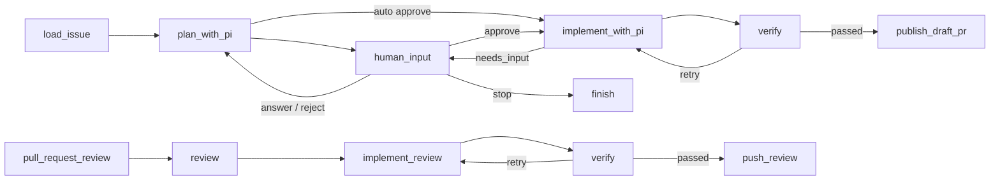

# Coding Agent Graph

סוכן קוד מקומי שמקבל פקודות מתגובות ב־GitHub Issues. FastAPI קולט webhooks, ‏LangGraph מנהל את התהליך והעצירות, Pi חוקר ועורך קוד ב־worktree ייעודי, ו־SQLite שומר checkpoints ומטא־דאטה.

## תהליך העבודה



Pi מתכנן עם כלי קריאה וחיפוש בלבד. לאחר אישור מפורש הוא מקבל כלי עריכה ו־shell בתוך ה־worktree. השירות עצמו בודק את ה־diff ומריץ `npm run lint` ו־`npm run build`; Pi אינו מקבל משתני GitHub ואינו מבצע push בעצמו. לאחר verification מוצלח השירות מבצע commit ו־push ופותח Draft PR אוטומטית.

כאשר נשלח review מסוג **Request changes** או **Comment**, השירות טוען את סיכום ה־review ואת ה־inline comments, מחזיר אותם ל־Pi באותו worktree/session, מאמת את התיקונים ודוחף commit נוסף לאותו PR. Review מסוג **Approve** אינו משנה קוד והמיזוג נשאר ידני.

### אישור תוכנית

כברירת מחדל התוכנית ממתינה ל־`/agent approve`. ‏`/agent start auto` מדלג על האישור עבור ריצה אחת, ו־`REQUIRE_PLAN_APPROVAL=false` מדלג עליו כברירת מחדל. במצב זה התוכנית מתפרסמת כתגובה אינפורמטיבית והמימוש מתחיל מיד; שאלות הבהרה (`needs_input`) עדיין עוצרות לתשובה אנושית, וה־Draft PR נשאר נקודת הבקרה.

### תוצאה מובנית מ־Pi

Pi מסיים כל שלב בקריאה לכלי `submit_result` (‏[pi_extensions/submit_result.ts](pi_extensions/submit_result.ts)), שנטען עם `--extension`. הסכמה נאכפת על ידי Pi, הסטטוסים המותרים מוגבלים לפי השלב (`ready|needs_input|failed` בתכנון, `completed|needs_input|failed` במימוש), והכלי מחזיר `terminate: true` כך שאין סבב LLM נוסף. השירות קורא את התוצאה מאירוע `tool_execution_end` במקום לחלץ JSON מטקסט חופשי; חילוץ מטקסט נשאר רק כ־fallback למודלים שלא קוראים לכלי.

## התקנה והרצה

נדרש Python 3.11 ומעלה, Node.js, ‏Git ו־Pi.

```bash
npm install -g @earendil-works/pi-coding-agent

cd coding-agent-graph
python -m venv .venv
# Windows: .venv\Scripts\activate
# macOS/Linux: source .venv/bin/activate
pip install -r requirements.txt

cp .env.example .env
python -m uvicorn main:app --host 0.0.0.0 --port 8000
```

אין להפעיל את שרת הסוכן עם `--reload`: יצירת SQLite checkpoints ו־worktrees משנה קבצים מקומיים, ו־WatchFiles עלול להפעיל restart ולבטל את ה־worker באמצע ריצה. לאחר שינוי קוד, עצור והפעל את השרת מחדש ידנית.

ב־Windows עם מספר גרסאות Python אפשר ליצור את הסביבה באמצעות `py -3.13 -m venv .venv`.

יש להגדיר ב־`.env`:

- `GITHUB_TOKEN` — קריאת Issues, כתיבת תגובות, ובהמשך push ופתיחת PR. אם הוא ריק, השירות קורא את הטוקן המקומי מ־`gh auth token`. אין בקשת ולידציה יזומה לטוקן.
- `AUTHORIZED_GITHUB_USERS` — רשימת משתמשים מורשים מופרדת בפסיקים.
- `OPENROUTER_API_KEY` — מפתח שנמסר רק לתהליך Pi.
- `OPENROUTER_MODEL` — ברירת מחדל: `z-ai/glm-5.3`.

### מעקב אחרי הגרף עם Langfuse

כדי לראות כל הרצה כ־trace ואת סדר ה־nodes, הקלט/פלט, זמני הריצה והשגיאות, צור project ב־Langfuse והוסף ל־`.env`:

```dotenv
LANGFUSE_PUBLIC_KEY=pk-lf-...
LANGFUSE_SECRET_KEY=sk-lf-...
LANGFUSE_BASE_URL=https://cloud.langfuse.com
LANGFUSE_TRACING_ENVIRONMENT=development
LANGFUSE_TRACING_ENABLED=true
```

לאחר הפעלה מחדש של השרת, הרץ `/agent start` ופתח את **Tracing → Traces** ב־Langfuse. כל הפעלה או חידוש של הגרף מופיעים בשם `coding-agent:<action>`; כל מקטעי אותה ריצה מקובצים תחת session שזהה ל־`run_id`. אפשר לסנן גם לפי `repository`, ‏`issue_number`, ‏`action` והתגית `coding-agent-graph`.

אם שני המפתחות אינם מוגדרים, Langfuse כבוי והשירות ממשיך לעבוד ללא שינוי. אפשר להשבית במפורש באמצעות `LANGFUSE_TRACING_ENABLED=false`. שים לב ש־Langfuse מקבל את מצב הגרף, לרבות תוכן ה־Issue, התוכנית והחלטות האדם; בחר סביבת אירוח ומדיניות retention שמתאימות לרגישות המידע שלך.

חתימת ה־webhook אינה נבדקת כרגע, בהתאם להגדרת שלב הפיתוח הזה. לכן אין להסתמך על `AUTHORIZED_GITHUB_USERS` כמנגנון אבטחה כאשר ה־endpoint חשוף לאינטרנט: ללא אימות חתימה ניתן לזייף payload עם שם משתמש מורשה.

שאר ברירות המחדל מתועדות ב־`.env.example`. מצב LangGraph, בקשות, אירועי כלים, worktrees וסשני Pi נשמרים תחת `.agent-data` ואינם נשמרים ב־Git.

גם תור ה־webhooks נשמר ב־SQLite. השרת מחזיר `accepted` רק לאחר שמירת פריט העבודה, ומחזיר אוטומטית פריטים במצב `queued` או `processing` לתור לאחר restart. כשל בלתי צפוי מנוסה עד שלוש פעמים לפני שהפריט מסומן `failed`; כך restart באמצע review אינו דורש יצירת הערה חדשה.

## חיבור GitHub

חשוף את השרת באמצעות tunnel, לדוגמה:

```bash
ngrok http 8000
```

ב־repository פתח **Settings → Webhooks → Add webhook** והגדר:

- Payload URL: `https://<tunnel-host>/webhooks/github`
- Content type: `application/json`
- Secret: אפשר להשאיר ריק; השרת אינו מאמת אותו כרגע
- Events: **Issue comments** ו־**Pull request reviews**

## מעקב אחרי Pi

בזמן שהשרת רץ, אירועי Pi מופיעים ישירות במסוף של `uvicorn`:

```text
INFO pi [run=12ab34cd phase=plan] tool start: read {"path":"todo-app/src/App.tsx"}
INFO pi [run=12ab34cd phase=plan] tool end: read status=ok ...
INFO pi [run=12ab34cd phase=implement] tool start: bash {"command":"npm run lint"}
INFO pi [run=12ab34cd phase=implement] assistant: {"status":"completed",...}
```

כל האירועים נשמרים גם ב־SQLite. להצגת ההיסטוריה:

```bash
python pi_logs.py
```

למעקב רציף, בדומה ל־`tail -f`:

```bash
python pi_logs.py --follow
```

אפשר לסנן לפי ה־run ID שמופיע בתגובות ה־Issue ובלוג:

```bash
python pi_logs.py --follow --run-id 12ab34cd
```

`LOG_LEVEL=INFO` מציג התחלה וסיום של כל כלי ואת תשובת Pi. ‏`LOG_LEVEL=DEBUG` מציג גם עדכוני ביניים מכלים ארוכים. payloads נשמרים לאחר צנזור שדות רגישים וערכי המפתחות הידועים.

## פקודות Issue

```text
/agent start
/agent start auto
/agent answer <request-id> <text>
/agent approve <request-id>
/agent reject <request-id> <reason>
/agent stop
```

אין צורך ב־`/agent publish`: לאחר אימות מוצלח נפתח Draft PR אוטומטית. מספר ה־PR נשמר ב־SQLite ומשמש לקישור reviews עתידיים לאותו run. רק reviews ממשתמשים שמופיעים ב־`AUTHORIZED_GITHUB_USERS` נכנסים לתור העבודה. המיזוג נשאר ידני.

## בדיקות

```bash
pip install -r requirements-dev.txt
pytest
```

הבדיקות מכסות קליטת webhook ללא ולידציית טוקן, הרשאות, אירועים כפולים, אישור ישן, persistence ו־resume לאחר restart, פתיחת Draft PR, שמירת מספר PR, קליטת reviews, עצירה, כשל Pi וכשל בבדיקות repository.
