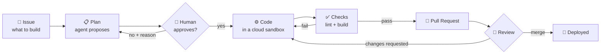

# 1. סקירה

> **במשפט אחד:** כותבים Issue, מגיבים `/agent start`, ומקבלים Pull Request שעבר בדיקות.

## הרעיון

רוב הכלים לכתיבת קוד עם AI עובדים בתוך העורך של מפתח אחד. הסוכן הזה עובד במקום שבו הצוות כבר מנהל את העבודה, כלומר ב־GitHub:

- **המשימה** היא Issue.
- **השיחה** עם הסוכן מתנהלת בתגובות על ה־Issue.
- **התוצר** הוא Pull Request רגיל, שעובר review ומיזוג כמו כל קוד אחר.

## שלושה עקרונות

1. **האדם מחליט, הסוכן מבצע.** יש שתי נקודות בקרה אנושיות: אישור התוכנית לפני שנכתבת שורת קוד, ו־review על ה־PR לפני המיזוג. המיזוג תמיד ידני.
2. **הסוכן לא מקבל מפתחות.** הוא רץ ב־sandbox בענן בלי טוקן של GitHub ובלי מפתח API. הסודות מתווספים לבקשות ברמת הרשת, מחוץ להישג ידו.
3. **בדיקות, לא הבטחות.** השרת לא סומך על מה שהסוכן אומר שבדק. הוא מריץ את הבדיקות בעצמו, ו־PR נפתח רק אם הן עוברות.

## מה יש בפרויקט

| חלק | מה הוא |
|-----|--------|
| `todo-app/` | אפליקציית React שעליה הסוכן עובד בדמו. מתפרסמת ל־GitHub Pages בכל מיזוג ל־`main`. |
| `coding-agent-graph/` | הסוכן: שרת FastAPI, גרף LangGraph, הרצת Pi וניהול sandboxes. |
| `docs/` | התיעוד הזה. |

## הטכנולוגיות

| תפקיד | כלי |
|-------|-----|
| קליטת אירועים מ־GitHub | FastAPI + webhooks |
| ניהול התהליך, העצירות וההמשך | LangGraph עם checkpoints ב־SQLite |
| הסוכן שקורא וכותב קוד | Pi (coding agent) דרך OpenRouter |
| סביבת ריצה מבודדת | Docker Cloud Sandboxes (`sbx --cloud`) |
| התראות | Telegram, עם Topic לכל Issue |
| Tracing | Langfuse |
