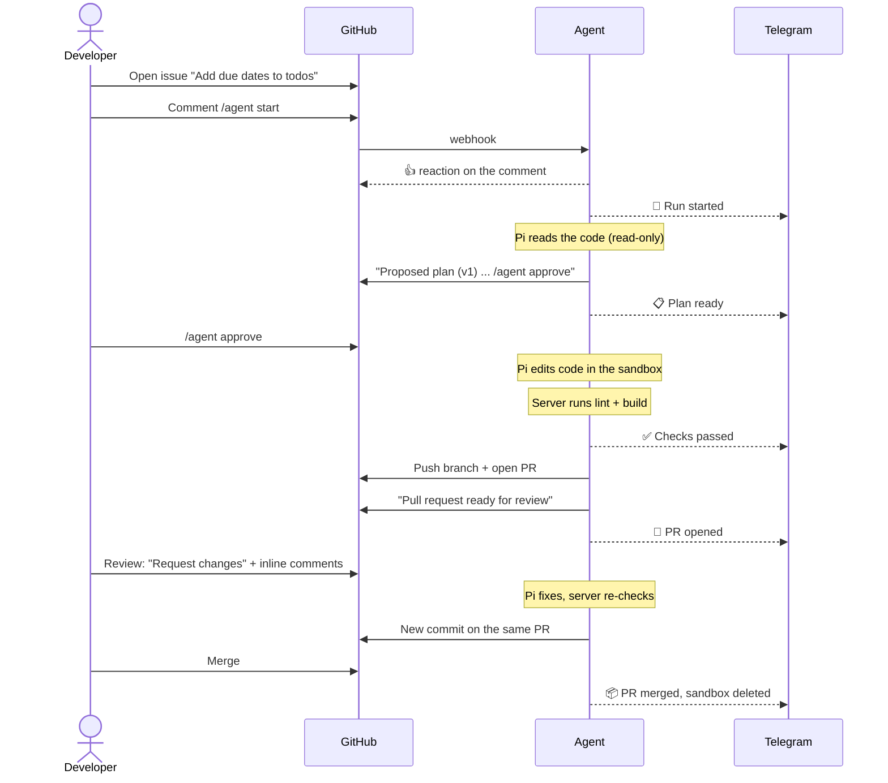
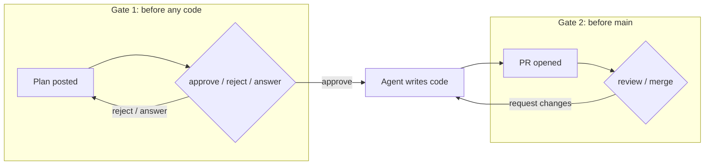

# 2. מסע המשתמש

> **מה המשתמש רואה:** הכול קורה בתגובות על ה־Issue וה־PR. אין ממשק נוסף ללמוד.

## המסלול המלא

## הפקודות

כל פקודה היא תגובה על ה־Issue. רק משתמשים שמופיעים ב־`AUTHORIZED_GITHUB_USERS` יכולים להפעיל את הסוכן.

| פקודה | מתי | מה קורה |
|-------|-----|---------|
| `/agent start` | על Issue חדש | פותח run: תכנון, ואז המתנה לאישור |
| `/agent start auto` | כשסומכים על הסוכן במשימה | מדלג על אישור התוכנית. שאלות הבהרה עדיין עוצרות |
| `/agent approve` | אחרי שהתוכנית פורסמה | מתחיל לכתוב קוד |
| `/agent reject <reason>` | התוכנית לא טובה | הסוכן מתכנן מחדש עם הסיבה |
| `/agent answer <text>` | הסוכן שאל שאלה | התשובה נכנסת להחלטות, והסוכן ממשיך |
| `/agent stop` | בכל שלב | עוצר את ה־run, כולל Pi שרץ באותו רגע |

ל־`approve`, `answer` ו־`reject` אפשר להוסיף מזהה בקשה (למשל `/agent approve a1b2c3d4-p1-a`). בלי מזהה, הפקודה הולכת לבקשה שממתינה ב־Issue.

## שתי נקודות ההחלטה של האדם

- **שער 1** חוסך זמן: אם הסוכן הבין לא נכון, עוצרים אותו לפני שכתב קוד. עם `auto` מוותרים על השער הזה ומסתמכים על שער 2.
- **שער 2** תמיד קיים: הסוכן לא ממזג. גם reviews נכנסים לעבודה רק ממשתמשים מורשים.

## מה הסוכן יכול לשאול

אם Pi נתקל בהחלטה שמשנה את התנהגות המוצר, הוא מחזיר `needs_input` במקום לנחש. בחירות טכניות רגילות הוא אמור להסיק מהקוד. השאלה מתפרסמת כתגובה, וה־run מחכה. בזמן ההמתנה ה־sandbox מושהה ולא עולה כסף.
