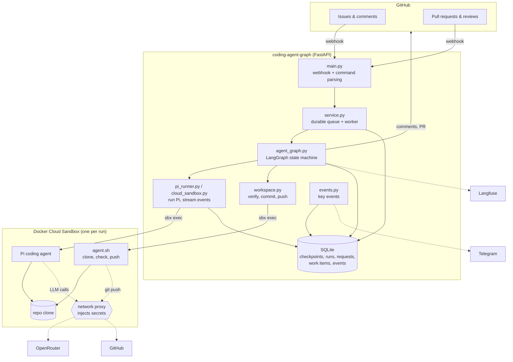

# 3. ארכיטקטורה

> **בקצרה:** שרת אחד מתזמר. ‏LangGraph מחליט מה עכשיו, ‏Pi כותב את הקוד בתוך sandbox, ו־SQLite זוכר הכול.

## רכיבים

## מה כל חלק עושה

| קובץ | אחריות |
|------|--------|
| [main.py](../coding-agent-graph/main.py) | מקבל webhooks, מאמת את החתימה, מסנן אירועים לא רלוונטיים (בוטים, תגובות בלי `/agent`) ומפענח את הפקודה. |
| [commands.py](../coding-agent-graph/commands.py) | מפענח `/agent ...` ל־`AgentCommand`. |
| [service.py](../coding-agent-graph/service.py) | בודק הרשאה, שומר את פריט העבודה ב־SQLite ומחזיר `202`. worker אחד מעבד את התור ומפעיל את הגרף. |
| [agent_graph.py](../coding-agent-graph/agent_graph.py) | הגרף: טעינת Issue, תכנון, המתנה לאדם, מימוש, בדיקות ו־PR. ראו [04](04-state-graph.md). |
| [pi_runner.py](../coding-agent-graph/pi_runner.py) | מריץ את Pi, קורא את זרם האירועים שלו (JSONL), אוכף timeout ו־stop, ומחלץ את התוצאה המובנית. |
| [cloud_sandbox.py](../coding-agent-graph/cloud_sandbox.py) | אותו ממשק, רק דרך `sbx --cloud`: יצירה, הפעלה, השהיה ומחיקה של sandbox, וניסיונות חוזרים על תקלות רשת. |
| [workspace.py](../coding-agent-graph/workspace.py) | בודק את ה־diff ומריץ `npm run lint` ו־`npm run build`. אחר כך commit ו־push. |
| [sandbox/agent.sh](../coding-agent-graph/sandbox/agent.sh) | הסקריפט שרץ בתוך ה־sandbox: `setup`, `check`, `commit-push`, `pi`, `stop-pi`. |
| [pi_extensions/submit_result.ts](../coding-agent-graph/pi_extensions/submit_result.ts) | כלי שבו Pi מגיש את התוצאה בסכמה קבועה, במקום טקסט חופשי. |
| [graph_view.py](../coding-agent-graph/graph_view.py) | מצייר את הגרף מתוך LangGraph, ומסמן עליו את ההתקדמות של run. מוגש ב־`/graph`. |
| [events.py](../coding-agent-graph/events.py) | אירועי מפתח: נשמרים ב־SQLite, נכתבים ללוג ונשלחים ל־Telegram. |
| [storage.py](../coding-agent-graph/storage.py) | כל הטבלאות: `runs`, `requests`, `work_items`, `deliveries`, `pi_events`, `events`, `telegram_topics`. |

## שני מצבי ריצה

| | `EXECUTION_MODE=local` | `EXECUTION_MODE=cloud` |
|---|---|---|
| איפה Pi רץ | במחשב המקומי, ב־git worktree | ב־Docker Cloud Sandbox |
| מאיפה הקוד | clone מקומי קיים | `gh repo clone` בתוך ה־sandbox |
| מי עושה push | השרת, עם הטוקן שלו | ה־sandbox, דרך ה־proxy |
| בידוד | משתני סביבה מסוננים | VM נפרד, רשת חסומה, סודות מחוץ ל־sandbox |

שני המצבים עוברים דרך אותו ממשק (`WorkspaceManager` ו־`PiRunner`), ולכן הגרף לא יודע באיזה מצב הוא רץ.

## למה LangGraph

ה־run נמשך שעות ואפילו ימים, כי הוא מחכה לאדם. ‏LangGraph נותן:
- **‏`interrupt()`**: הגרף נעצר באמצע node, נשמר ל־SQLite, ומשתחרר. אין תהליך שמחכה.
- **‏`Command(resume=...)`**: כשמגיעה תגובה, הגרף ממשיך בדיוק מאותה נקודה, גם אחרי restart של השרת.
- **Thread לכל run**: ‏`thread_id` מחבר בין ה־checkpoints של אותו run.
