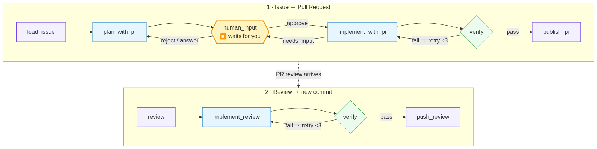
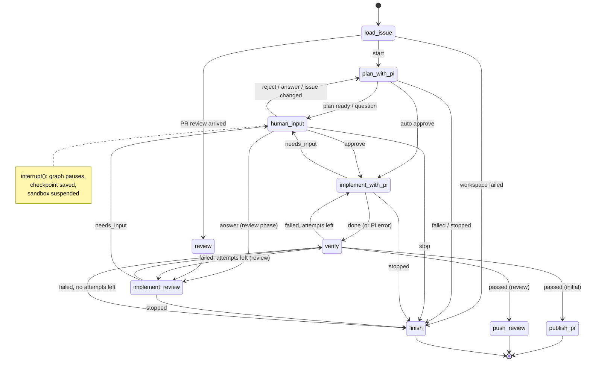
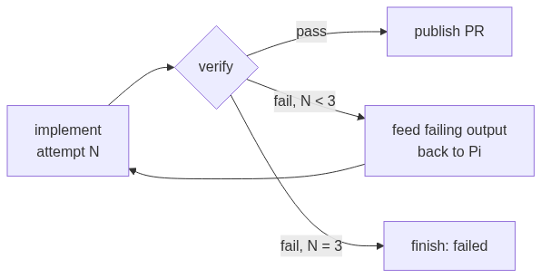
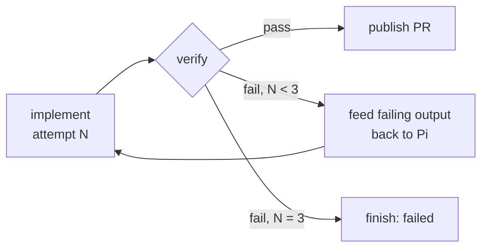

# 4. גרף המצבים

> **בקצרה:** כל run הוא מעבר בין nodes. בכל node הגרף שומר checkpoint, ובנקודות ההחלטה הוא נעצר עד שאדם עונה.

## בתמונה אחת (לשקף)

כחול: Pi עובד. צהוב: הגרף עוצר ומחכה לאדם. ירוק: השרת מריץ בדיקות. סגול: עבודה מול GitHub. היציאות ל־`finish` (כשל או עצירה) הושמטו. המקור: [graph-slide.mmd](graph-slide.mmd).

## הגרף

הדיאגרמה כאן מצוירת ביד ומסבירה את המעברים. הגרסה שנוצרת אוטומטית מהקוד נמצאת ב־[langgraph.md](langgraph.md), והגרסה החיה בכתובת `/graph` של השרת (ראו [08](08-observability.md)).

## ה־nodes

| Node | מה הוא עושה | כלים של Pi |
|------|-------------|------------|
| `load_issue` | טוען את ה־Issue והתגובות, מחשב `requirements_version` (hash של הדרישות), ויוצר branch ו־sandbox. | — |
| `plan_with_pi` | Pi חוקר את הקוד ומגיש תוכנית, שאלות או כשל. | `read, grep, find, ls` |
| `human_input` | מפרסם תוכנית או שאלה כתגובה ונעצר (`interrupt`). כשמגיעה תשובה, היא נרשמת ב־`decisions`. | — |
| `implement_with_pi` | Pi מממש את התוכנית המאושרת. בניסיון חוזר הוא מקבל את הפלט של הבדיקות שנכשלו. | `read, bash, edit, write, grep, find, ls` |
| `verify` | השרת בודק שהשינויים בתוך התיקייה המותרת ומריץ lint ו־build. | — |
| `publish_pr` | בודק שהקוד לא השתנה מאז הבדיקות, ואז commit, push ו־PR. | — |
| `review` | טוען את סיכום ה־review ואת ה־inline comments. | — |
| `implement_review` | Pi מתקן לפי ה־review באותו sandbox ובאותו session. | כמו במימוש |
| `push_review` | commit נוסף לאותו PR. | — |
| `finish` | תגובת סיכום: סטטוס, קבצים שהשתנו ובדיקות. | — |

## לולאת התיקון

`AGENT_MAX_ATTEMPTS` (ברירת מחדל 3) מגביל את מספר הניסיונות. בכל ניסיון Pi מקבל את 2,000 התווים האחרונים מהפלט של כל בדיקה שנכשלה, וממשיך באותו session, כך שהוא זוכר מה כבר ניסה.

## הגנות מובנות בגרף

- **דרישות שהשתנו:** אם ה־Issue נערך בזמן שהתוכנית חיכתה לאישור, `approve` הופך ל־`requirements_changed` והסוכן מתכנן מחדש.
- **אישור ישן:** אישור של גרסת תוכנית קודמת נדחה ("That approval is for an old plan version").
- **קוד שהשתנה אחרי בדיקה:** ‏`publish_pr` ו־`push_review` משווים את ה־revision (‏hash של HEAD ושל הקבצים) למה שנבדק. אם יש פער, הם מריצים בדיקות שוב או מסרבים.
- **review בלי שינוי:** אם Pi "תיקן" review בלי לשנות קוד, הבדיקה נכשלת.
