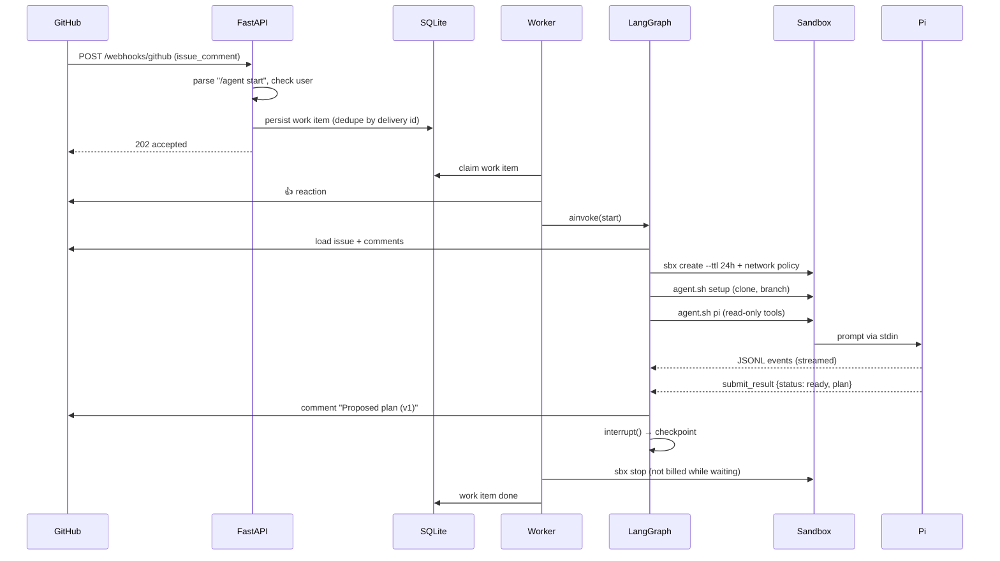
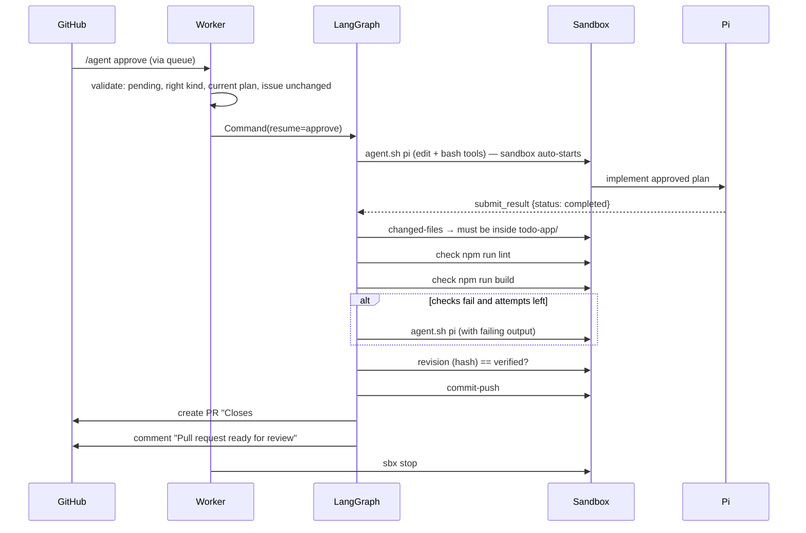
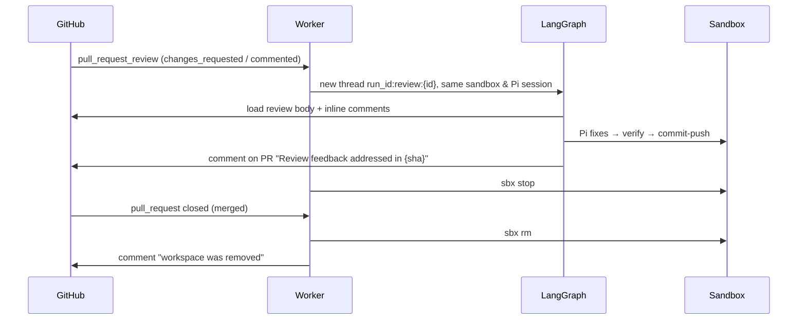

# 5. ריצה מקצה לקצה

> **בקצרה:** כל webhook הופך לפריט עבודה שמור. ה־worker מריץ את הגרף עד שהוא נעצר, משהה את ה־sandbox ומשתחרר.

## מ־`/agent start` עד תוכנית

## מאישור עד PR

## Review ו־merge

## איך Pi מחזיר תוצאה

Pi לא מסיים בטקסט חופשי. הוא קורא לכלי `submit_result`, והכלי:
- אוכף סכמה: `status`, ‏`summary`, ‏`plan`, ‏`questions`, ‏`claimed_checks`.
- מגביל את הסטטוסים לפי השלב: `ready | needs_input | failed` בתכנון, ‏`completed | needs_input | failed` במימוש.
- מחזיר `terminate: true`, כך שאין סבב LLM מיותר אחרי ההגשה.

השרת קורא את התוצאה מאירוע `tool_execution_end`. חילוץ JSON מטקסט נשאר רק כ־fallback למודלים שלא קוראים לכלי.
