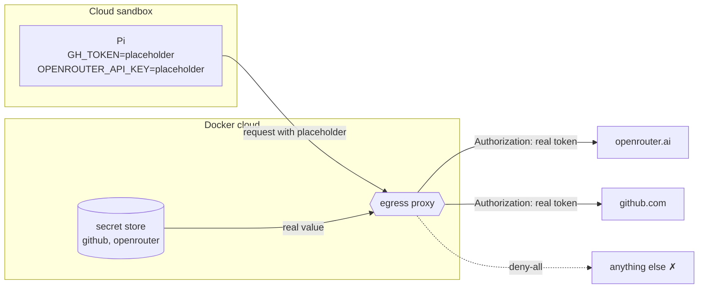
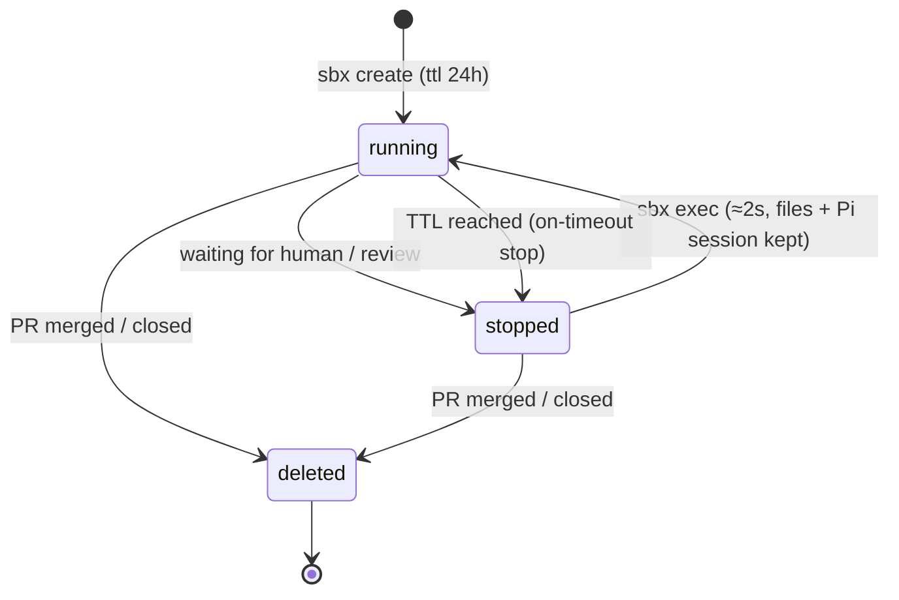

# 6. Sandbox ואבטחה

> **בקצרה:** הסוכן כותב ומריץ קוד, אבל בתוך VM בענן, בלי סודות, עם רשת חסומה, ובלי יכולת לדחוף או למזג בעצמו.

## איפה הסודות נמצאים

- הסודות נשמרים פעם אחת ב־secret store של Docker (`sbx --cloud secret set ...`).
- בתוך ה־sandbox יש רק ערכי placeholder. גם אם Pi מדפיס את משתני הסביבה, הוא לא רואה מפתח אמיתי.
- ה־proxy מחליף את ה־placeholder בערך האמיתי רק בבקשות ל־hosts המורשים.

## שכבות ההגנה

| שכבה | מה היא מונעת |
|------|---------------|
| **VM נפרד לכל run** | ריצה אחת לא רואה קבצים של אחרת או של המחשב המקומי. |
| **רשת `deny-all`** | Pi לא יכול לשלוח קוד או מידע לשרת זר. מותרים רק ה־hosts של ה־Kit ו־`SANDBOX_ALLOW_NETWORK`. |
| **כלים לפי שלב** | בתכנון Pi מקבל רק `read, grep, find, ls`. עריכה ו־shell מגיעים רק אחרי אישור. |
| **גבול תיקייה** | ‏`verify` דוחה כל שינוי מחוץ ל־`todo-app/`. ‏Pi לא יכול לשנות את ה־workflow, את הסוכן עצמו או את ה־CI. |
| **השרת בודק, לא Pi** | ‏lint ו־build רצים מהשרת. מה ש־Pi "טוען שבדק" (`claimed_checks`) לא משפיע. |
| **השרת מחליט מתי לדחוף** | ‏push רק אחרי בדיקות שעברו, ורק אם ה־revision זהה לזה שנבדק. |
| **אין מיזוג** | הסוכן פותח PR ולא ממזג. מומלץ להגדיר branch protection על `main`. |
| **חתימת webhook** | כל בקשה נבדקת ב־HMAC-SHA256 מול `GITHUB_WEBHOOK_SECRET`. בלי חתימה תקינה: `401`. בלי סוד מוגדר, השרת מסרב לכל webhook. |
| **משתמשים מורשים** | פקודות ו־reviews רק מ־`AUTHORIZED_GITHUB_USERS`. תגובות של בוטים מסוננות. |
| **צנזור** | טוקנים ומפתחות מוחלפים ב־`[REDACTED]` בלוגים, ב־SQLite וב־Telegram. |

## מחזור החיים של sandbox

sandbox עצור לא עולה כסף. הקבצים וה־session של Pi נשמרים, כך שאישור שמגיע אחרי יום ממשיך מאותה נקודה.

## פערים ידועים (שלב הדמו)

- **הטוקן של GitHub מאפשר push.** מומלץ fine-grained PAT ל־repository אחד בלבד, יחד עם branch protection.
- **הסוכן קורא תוכן מה־Issue.** מי שיכול לכתוב Issue יכול לנסות prompt injection. הבידוד והבדיקות מגבילים את הנזק, וה־review האנושי הוא קו ההגנה האחרון.
