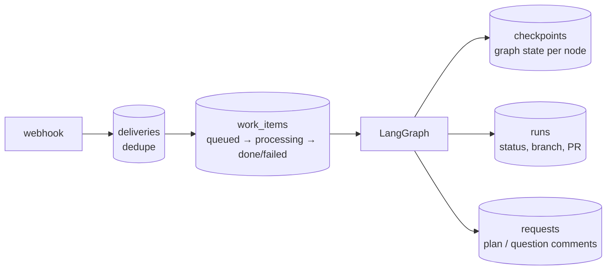

# 7. אמינות

> **בקצרה:** כל דבר שקורה נשמר קודם ל־SQLite ורק אחר כך מבוצע. אפשר להפיל את השרת בכל רגע, והוא ממשיך מאיפה שעצר.

## מה נשמר איפה

| טבלה | מה היא מבטיחה |
|------|----------------|
| `deliveries` / `work_items` | webhook שמגיע פעמיים (GitHub שולח שוב) מעובד פעם אחת. `202` חוזר רק אחרי שהפריט נשמר. |
| LangGraph checkpoints | הגרף ממשיך מה־node האחרון שהושלם, לא מההתחלה. |
| `runs` | run פעיל אחד לכל Issue, ומיפוי PR → run בשביל reviews. |
| `requests` | כל תגובה שהסוכן מפרסם מקבלת מזהה ו־hash. אם הגרף רץ שוב על אותו node, התגובה לא תתפרסם פעמיים. |

## תרחישי כשל

| מה קרה | מה המערכת עושה |
|--------|-----------------|
| השרת נפל באמצע run | בעלייה, פריטים במצב `queued` או `processing` חוזרים לתור. הגרף ממשיך מה־checkpoint. |
| נפל אחרי שהאישור נרשם, לפני שהעבודה הסתיימה | `_continue_interrupted_run` מזהה שהבקשה כבר נפתרה אבל הגרף באמצע שלב, וממשיך אותו. |
| שגיאה לא צפויה | עד 3 ניסיונות לכל פריט עבודה. אחר כך הוא מסומן `failed`, ונשלחת תגובה ב־Issue והתראה `🔥`. |
| Pi נתקע | `PI_TIMEOUT_SECONDS` (ברירת מחדל 900) הורג אותו, כולל התהליך שבתוך ה־sandbox. |
| `/agent stop` באמצע ריצה של Pi | ה־run מסומן `stop_requested`. ‏`PiRunner` בודק את זה כל שנייה, הורג את Pi ומריץ `pkill -x pi` ב־sandbox. |
| תקלת רשת מול Docker | `sbx` מנסה שוב אחרי 3, 10 ו־30 שניות, ורק על שגיאות שקורות לפני שהבקשה הגיעה ל־sandbox. |
| sandbox באמצע עצירה | ממתינים שיתייצב (עד 5 דקות) ואז מנסים שוב. |
| בדיקות נכשלו | עד 3 ניסיונות מימוש, וכל ניסיון מקבל את הפלט שנכשל. |
| Telegram לא זמין | השליחה רצה בתור ברקע ולא עוצרת את ה־run. האירוע נשאר ב־SQLite. |

## שיקולי עיצוב

- **worker יחיד:** פשוט ובטוח (אין שני runs שמתחרים על אותו Issue), אבל Issues ממתינים זה לזה. אפשר להרחיב ל־N workers עם נעילה לפי Issue.
- **בלי `--reload`:** שינוי קבצים מקומיים (SQLite, worktrees) היה מפעיל restart ומבטל ריצה באמצע.
