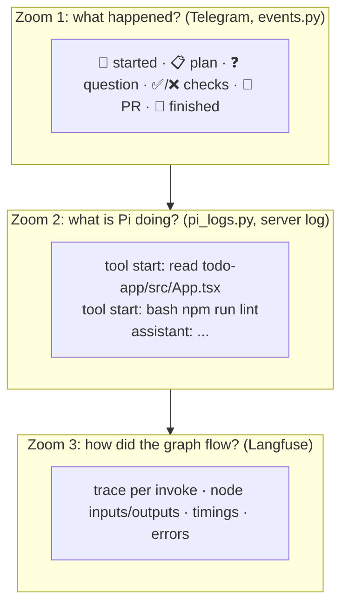

# 8. נראות

> **בקצרה:** שלוש רמות זום: Telegram לאירועי מפתח, `pi_logs.py` לכל פעולה של Pi, ו־Langfuse לכל מעבר בגרף. ובנוסף, `/graph` מראה איפה כל run נמצא עכשיו.

## שלוש רמות



## 1. אירועי מפתח ו־Telegram

[events.py](../coding-agent-graph/events.py) מרכז את האירועים שבן אדם רוצה לדעת עליהם:

| | אירוע | | אירוע |
|---|---|---|---|
| 🚀 | run התחיל | ✅ | בדיקות עברו |
| 📋 | תוכנית מוכנה | ❌ | בדיקות נכשלו (עם הפלט) |
| ❓ | ממתין לתשובה | 🔀 | PR נפתח |
| 🆕 🟢 ⏸️ 🗑️ | sandbox נוצר, הופעל, נעצר, נמחק | ⬆️ | תיקוני review נדחפו |
| 🔁 | ניסיון חוזר מול Docker | 🏁 | run הסתיים |
| 📝 | review התקבל | 📦 | PR מוזג או נסגר |
| 🔥 | פריט עבודה נכשל סופית | | |

בקבוצת Telegram עם Topics, כל Issue מקבל Topic משלו, כך שה־timeline של כל משימה נשאר נפרד.

```bash
python events.py --follow             # live
python events.py --run-id d83d7e04    # one run's timeline
```

## 2. מה Pi עושה

כל אירוע של Pi (התחלה וסיום של כלי, תשובה, retry, compaction) נשמר בטבלה `pi_events` ומודפס ללוג של השרת:

```text
INFO pi [run=12ab34cd phase=plan] tool start: read {"path":"todo-app/src/App.tsx"}
INFO pi [run=12ab34cd phase=implement] tool start: bash {"command":"npm run lint"}
```

```bash
python pi_logs.py --follow --run-id 12ab34cd
```

## 3. ‏Langfuse

כל הפעלה או המשך של הגרף היא trace בשם `coding-agent:<action>`, וכל ה־traces של run מקובצים ב־session לפי `run_id`. אפשר לסנן לפי repository, ‏Issue ו־action, ולראות את הקלט והפלט של כל node ואת זמני הריצה.

## 4. הגרף החי: `/graph`

השרת מגיש את גרף ה־LangGraph כדף: `http://localhost:8000/graph`. הדיאגרמה נוצרת מהגרף המקומפל עצמו (`get_graph().draw_mermaid()`), ולכן תמיד תואמת לקוד.

- **בלי פרמטרים:** הגרף, ורשימת ה־runs האחרונים.
- **‏`/graph?run_id=d83d7e04`:** אותו גרף, עם צביעה של ה־run: ירוק = nodes שכבר רצו, צהוב = ה־node הנוכחי (או זה שבו ה־run מחכה לאדם). הדף מתרענן כל 5 שניות, כך שאפשר להשאיר אותו פתוח במסך בזמן דמו.

ההתקדמות נקראת מה־checkpoints של LangGraph ב־SQLite. אם השרת חשוף דרך tunnel, גם הדף הזה חשוף, ואפשר לראות בו שמות repositories ומספרי Issues.

```bash
python graph_view.py                          # print the Mermaid diagram
python graph_view.py --write ../docs/langgraph.md
```

## למעקב ידני ב־sandbox

```bash
sbx --cloud ls                                     # all sandboxes
sbx --cloud exec -it agent-issue-12-ab12cd34 bash  # look around, git diff
sbx --cloud policy log agent-issue-12-ab12cd34     # blocked network requests
```
