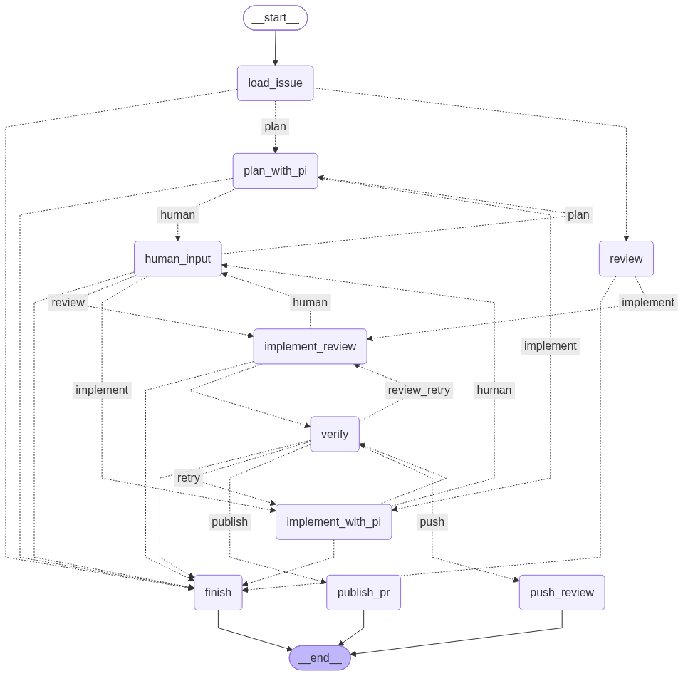
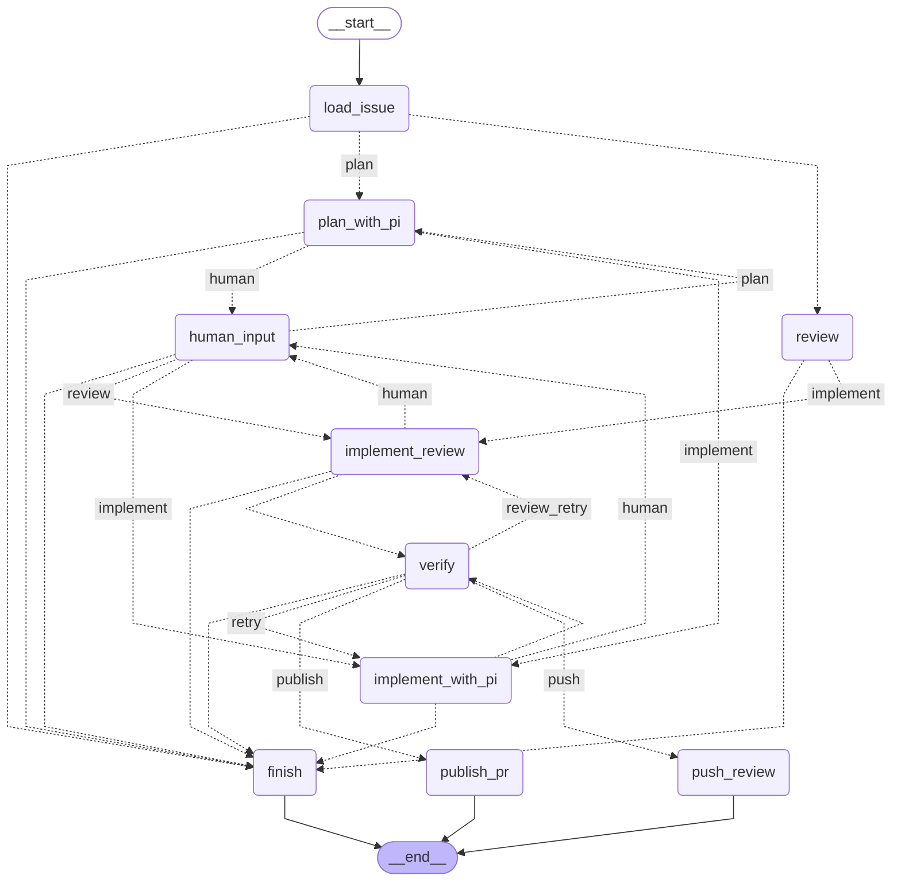

# The LangGraph workflow (generated)

Generated from the compiled graph by `python graph_view.py --write`; do not edit by hand.

Solid edges are fixed, dotted edges are conditional (the label is the router's choice).

